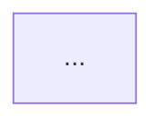

# Root Cause Analysis: Mermaid Syntax Errors

## Symptom
All rendered Mermaid diagrams in the **Archi Advisor Results** page show a red box with the error message: `Syntax error in text`. This occurs for:
- System Architecture
- C4 Model
- Deployment Architecture

## Investigation

### 1. AI Output Analysis
The current `SYSTEM_PROMPT` asks for diagrams in "Mermaid.js format". LLMs often interpret this by default as returning markdown-fenced code blocks:

When this string is saved into the JSON `diagram_format` field, and subsequently placed into the `DiagramRenderer`'s `innerHTML`, the Mermaid parser encounters the triple backticks (```) and the word `mermaid` as the first line of text. Since these are not valid Mermaid commands, the parser throws a `Syntax error in text` exception.

### 2. Integration Method Review
The `DiagramRenderer.jsx` uses `mermaid.contentLoaded()`, which is a legacy method designed for static HTML pages. In a React environment:
- It triggers a global DOM sweep every time *any* diagram component is mounted or updated.
- It can cause race conditions where multiple rendering passes interfere with each other.
- It is incompatible with the strict rendering lifecycle of Mermaid v11.x, which expects asynchronous initialization or explicit rendering calls (`mermaid.run`).

### 3. Arrow Label Hallucination
The AI was observed generating labels on arrows in `graph TD` diagrams (e.g., `-->|send message|> B`). This syntax is extremely brittle in Mermaid v11.12.2 when combined with trailing characters. Specifically, the parser fails when encountering a `>` inside or immediately after a pipe-encapsulated label.

## Conclusion
The errors are caused by a combination of:
1. **Systematic AI Over-formatting**: The AI includes markdown triple backticks.
2. **Syntax Hallucination**: The AI uses legacy or invalid arrow label formats that break the v11.x parser.
3. **Brittle Integration**: The `contentLoaded()` method was not thread-safe for React.

## Resolution Plan

### Technical Fixes
1. **Prompt Hardening**: Updated `SYSTEM_PROMPT` to explicitly forbid arrow labels (`-->|text|`), semicolons, and trailing `>` characters.
2. **Frontend Safeguard**: Added a **Regex Sanitizer** in `DiagramRenderer.jsx` that automatically strips any `-->|...|` labels before rendering. This acts as a permanent fail-safe against AI hallucinations.
3. **Modern Integration**: Rewrote `DiagramRenderer.jsx` to use `mermaid.run()` for isolated, asynchronous rendering.
