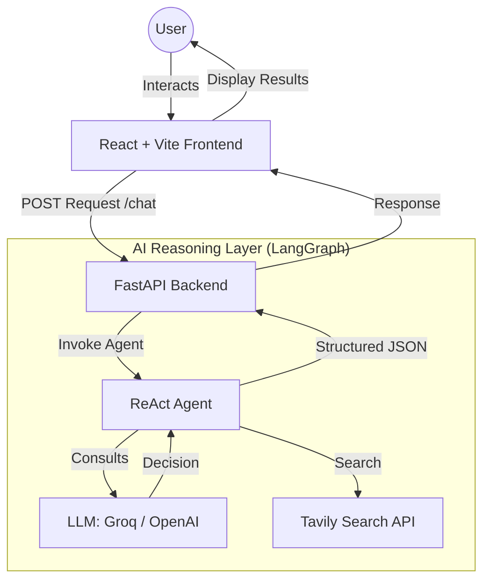

# Archi The Architech - Project Working

This document provides a comprehensive overview of how **Archi The Architech** operates, covering its architecture, data flow, and core components.

> [!IMPORTANT]
> **Note:** Mermaid diagram generation is temporarily disabled to resolve rendering errors. The system currently focuses on providing structured technical recommendations and tech stack summaries.

## 🏗️ System Architecture

The project follows a modern full-stack architecture with a React frontend and a FastAPI backend, orchestrated by LangGraph for AI reasoning.

## 🔄 Functional Flow

1.  **User Input:** The user fills out a form on the frontend specifying project title, type, user count, features, budget, and scalability needs.
2.  **Request Construction:** The frontend (`RecommendationForm.jsx`) bundles these inputs into a prompt and sends it to the backend. It also includes the `SYSTEM_PROMPT` which defines the AI's persona and strict output rules.
3.  **Backend Processing:** The FastAPI server (`back.py`) receives the request, validates the model and provider, and calls the AI agent logic.
4.  **AI Orchestration:** The `Agent_ai.py` script initializes a LangGraph ReAct agent. This agent:
    -   Uses a **System Prompt** to act as a "Senior Software Architect".
    -   Can use **Tavily Search** to look up modern technologies if needed.
    -   Reason through the requirements to determine a valid technical stack.
5.  **Structure Output:** The AI MUST return a structured JSON response (Approved or Rejected).
6.  **Frontend Visualization:** The frontend parses the JSON:
    -   If approved, it displays the tech stack and renders architecture diagrams using **Mermaid.js** via the `DiagramRenderer.jsx`.
    -   If rejected, it shows the reason and technical explanation.

## 🛠️ Core Components

### 1. Frontend (`ai-tech-advisor-frontend`)
-   **`RecommendationForm.jsx`**: The heart of data collection. It contains the logic for multi-select features and sends the data to the backend.
-   **`ResultPage.jsx`**: Displays the AI's recommendations, including technical descriptions and architecture types.
-   **`DiagramRenderer.jsx`**: Dynamically renders Mermaid diagrams generated by the AI.

### 2. Backend (`Server`)
-   **`back.py`**: The FastAPI entry point. Handles CORS and defines the `/chat` endpoint.
-   **`Agent_ai.py`**: Contains the LangGraph configuration and agent initialization logic. It manages the interaction between the LLM and the tools.

## 📋 Technology Stack

-   **Frontend:** React, Vite, Axios, TanStack Query, CSS
-   **Backend:** FastAPI, Python, Pydantic
-   **AI Frameworks:** LangChain, LangGraph
-   **LLMs:** Groq (Llama 3), OpenAI (GPT-4o-mini)
-   **Search Tool:** Tavily Search API

## 🚀 How to Run the Project

1.  **Backend:**
    -   Navigate to `Server/`
    -   Run `python back.py` (or use the provided `run_server.ps1`).
    -   Ensure `.env` contains `GROQ_API_KEY`, `OPENAI_API_KEY`, and `TAVILY_API_KEY`.
2.  **Frontend:**
    -   Navigate to `ai-tech-advisor-frontend/`
    -   Run `npm install` followed by `npm run dev`.
3.  **Automation:**
    -   Use `start_all.ps1` in the root directory to start both services simultaneously.
